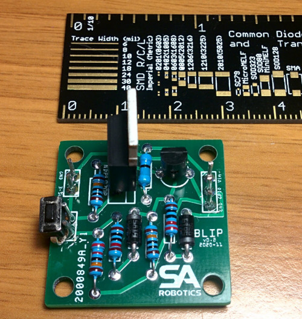

# BLIP

Like an Amazon Dash Button, the BLIP device can be used for your own purpose.

This software is made to work with WeMos D1 mini and with BLIP auto power off circuit that you can find here: http://www.sa-robotics.com/it/auto-power-off-circuit/

Simple wiring diagram:

Photo
